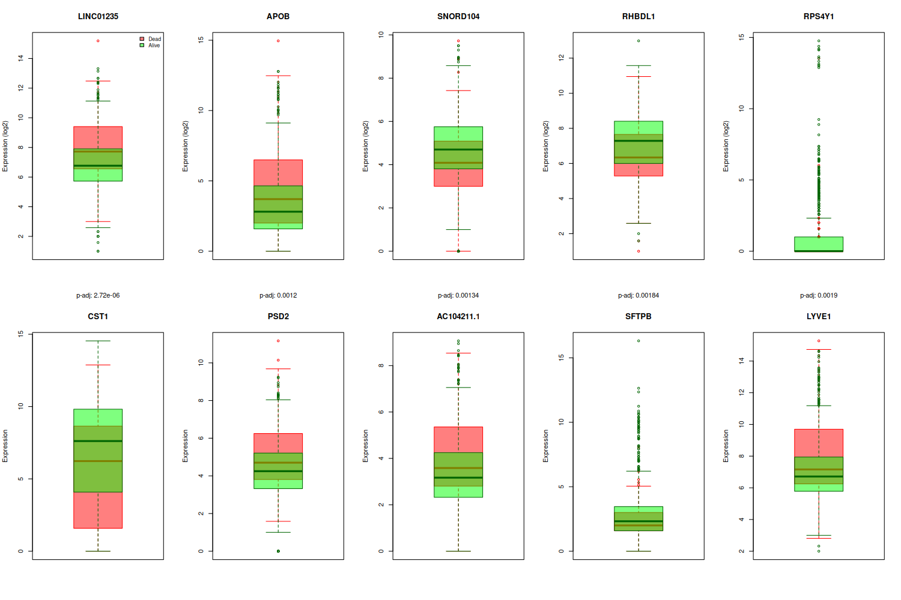
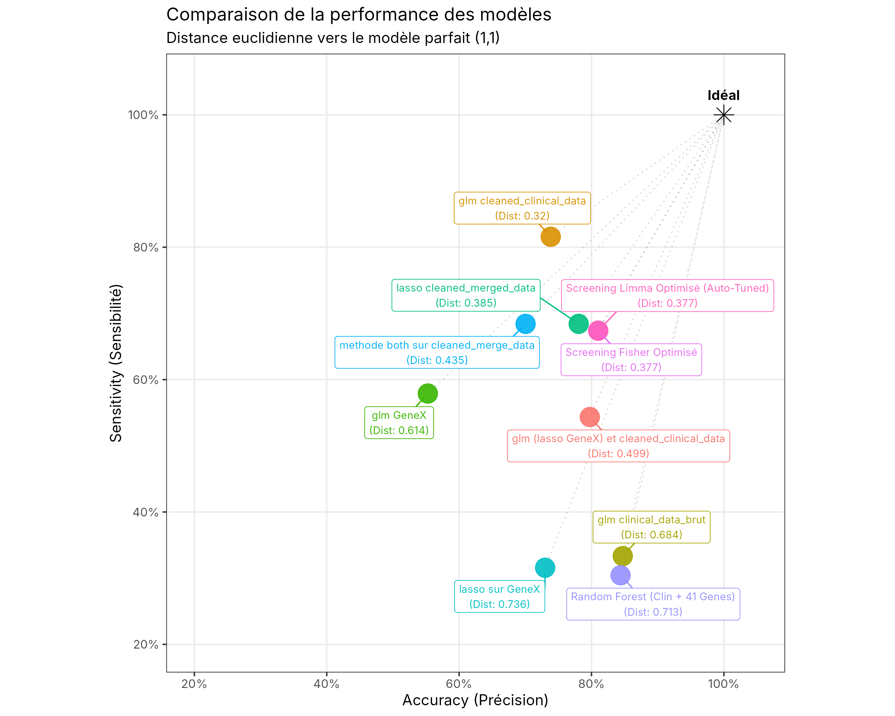

<div align="center">

# Breast Cancer Outcome Prediction

Predicting the vital status of breast cancer patients from clinical variables<br>
and 5,000-gene mRNA expression profiles, with a strict train/test protocol.


</div>

<br>

| | |
|---|---|
| Context | Two-person project, M.R.R. course, Université Paris-Saclay (November-December 2025) |
| Data | 1,231 patients (TCGA breast cancer cohort), 24 clinical variables, 5,000 genes |
| Methods | Logistic regression, Lasso, stepwise AIC, Fisher and limma gene screening, Random Forest |
| Best model | Imputed clinical GLM: AUC 0.83, sensitivity 82 % on the held-out test set (see the caveat on follow-up time below) |

---

## Contents

- [The problem](#the-problem)
- [Pipeline](#pipeline)
- [Results](#results)
- [Getting started](#getting-started)
- [Repository structure](#repository-structure)
- [Limitations and next steps](#limitations-and-next-steps)

---

## The problem

Two difficulties shape the whole analysis:

- High dimension: p = 5,000 genes for n ≈ 1,200 patients, so an unpenalised model on all genes overfits.
- Class imbalance: 84 % alive, 16 % deceased. A model that always predicts "alive" already scores 84 % accuracy, so the analysis focuses on AUC and sensitivity (the share of deceased patients correctly identified).

## Pipeline

### 1. Data cleaning ([`01_data_cleaning.Rmd`](notebooks/01_data_cleaning.Rmd))

| Step | What is done |
|---|---|
| Leakage | Remove `follow_ups_disease_response`, a post-treatment variable unavailable at diagnosis |
| Missing values | `Unknown`, `Not Reported`, `NULL` become `NA`; patients with more than 30 % missing values are dropped (1,187 remain) |
| Uninformative columns | Constant, near-zero-variance and identifier columns removed |
| Imputation | Median for numerical variables; mode or an `Unknown` level for categorical ones; categories under 5 % grouped into `Other` |
| Feature engineering | Histology (ductal / lobular / other), AJCC T stage (T1 to T4 / other), primary vs non-primary tumour, typical vs atypical site |

### 2. Modelling ([`02_modeling.Rmd`](notebooks/02_modeling.Rmd))

- Stratified 80/20 train/test split.
- Decision threshold chosen by Youden's J on the training ROC curve, then applied unchanged to the test set.
- Gene selection always computed on the training set only: Lasso screening, Fisher score (number of genes chosen by k-fold cross-validation), t-test ranking, limma.

<p align="center"></p>

<p align="center"><sub>Exploration: expression (log2) of the 10 genes with the smallest Bonferroni-adjusted t-test p-values, deceased patients in red, living patients in green. From the <a href="reports/exploration_report.pdf">exploration report</a>.</sub></p>

## Results

Test-set results obtained by running the two notebooks as they are in this repository (seeds are fixed, so the numbers are reproduced exactly).

| Model | AUC | Accuracy | Sensitivity | Specificity |
|---|---:|---:|---:|---:|
| GLM, clinical, no imputation | 0.720 | 84.7 % | 33.3 % | 93.0 % |
| GLM, clinical, imputed | 0.831 | 73.8 % | 81.6 % | 72.4 % |
| GLM, all genes | 0.559 | 55.3 % | 57.9 % | 54.8 % |
| Lasso, genes only | 0.637 | 73.0 % | 31.6 % | 80.9 % |
| Lasso, clinical + genes | 0.769 | 78.1 % | 68.4 % | 79.9 % |
| Stepwise AIC, clinical + top-50 genes (t-test) | 0.756 | 70.0 % | 68.4 % | 70.4 % |
| Fisher screening (top 10 genes) + clinical | 0.767 | 81.0 % | 67.4 % | 84.3 % |
| Lasso screening (41 genes) then GLM + clinical | 0.741 | 79.8 % | 54.3 % | 85.9 % |
| Random Forest, clinical + 41 genes | 0.721 | 84.4 % | 30.4 % | 97.4 % |

<p align="center">
  
</p>

### Takeaways

1. The imputed clinical model is the strongest one: AUC 0.83 and sensitivity 82 %, against 0.72 and 33 % when patients with missing values are dropped. The two models do not use exactly the same variables, though: the imputed one also keeps `days_to_last_follow_up` and `days_to_birth` (median-imputed), which the other drops. Follow-up time is recorded after diagnosis and is linked to the outcome, so part of this gain may come from leakage (see the limitations).
2. Genes alone carry little signal (AUC 0.56 unpenalised, 0.64 with Lasso). Without strong dimension reduction, the model mostly fits noise.
3. Genes add precision, not sensitivity. The best genomic model (Fisher top 10 + clinical) has the best balance of accuracy and specificity among models above 65 % sensitivity, but no genomic model beats the imputed clinical baseline on AUC.
4. Random Forest does not solve the imbalance. It reaches 97 % specificity but detects only 30 % of deceased patients, because minimising overall error favours the majority class.

The team's proposed use is two-step: the clinical model for screening, then the Fisher genomic model as a second, more specific opinion when expression data is available.

## Getting started

<details open>
<summary>1. Install R and the packages</summary>

```r
install.packages(c("caret", "glmnet", "randomForest", "pROC", "dplyr", "tidyr",
                   "stringr", "forcats", "ggplot2", "ggrepel", "MASS", "knitr", "rmarkdown"))
if (!requireNamespace("BiocManager", quietly = TRUE)) install.packages("BiocManager")
BiocManager::install(c("S4Vectors", "limma"))
```

</details>

<details open>
<summary>2. Add the data</summary>

Place the course dataset at `data/raw/mrr_bio.Rdata`. It is not redistributed; see [`data/README.md`](data/README.md) for its contents.

</details>

<details open>
<summary>3. Run the notebooks in order, from the <code>notebooks/</code> folder</summary>

| Notebook | Output | Time |
|---|---|---|
| `01_data_cleaning.Rmd` | cleaned objects in `data/processed/` | under a minute |
| `02_modeling.Rmd` | all models, `results/model_comparison.png` | about 10 minutes |

Use RStudio's *Run All*, or `knitr::purl()` followed by `Rscript`.

</details>

## Repository structure

```
├── data/
│   └── README.md               dataset description (data not redistributed)
├── notebooks/
│   ├── 01_data_cleaning.Rmd    exploration, cleaning, imputation, feature engineering
│   └── 02_modeling.Rmd         models, thresholds, comparison figure
├── results/
│   └── model_comparison.png    generated by 02_modeling.Rmd
├── docs/figures/
│   └── top_genes_ttest.png     figure from the exploration report
└── reports/
    ├── exploration_report.pdf  data exploration (French)
    ├── methodology_report.pdf  methodology and intermediate results
    └── oral_presentation.pdf   final presentation slides
```

## Limitations and next steps

- Follow-up time as a predictor: the imputed clinical data keeps `days_to_last_follow_up`. Like `follow_ups_disease_response`, it is not known at diagnosis, and its missing values may follow the vital status, so the 0.83 AUC is probably optimistic. Removing it (and re-running both notebooks) is the first fix to make.
- Single train/test split: with fewer than 50 deceased patients per test set, sensitivity estimates have wide confidence intervals. Repeated cross-validation would give more reliable comparisons.
- Splits differ between models (seeds 123 and 42 depending on the section), so small differences should not be over-interpreted.
- Vital status ignores follow-up time; a survival model (Cox, Kaplan-Meier) would use the data more fully.
- No external validation on an independent cohort.
- Possible improvements: class weighting or resampling inside cross-validation for tree models, pathway-level features (KEGG, Reactome) instead of single genes, gradient boosting on the screened genes.

## Reference

The Cancer Genome Atlas Network, *Comprehensive molecular portraits of human breast tumours*, Nature 490, 61-70 (2012). [doi:10.1038/nature11412](https://doi.org/10.1038/nature11412)

---

<div align="center">
<sub>Bilâl Jaiel · Kalaivaasan Balakumar<br><a href="https://github.com/bilal-jaiel">GitHub</a> · <a href="https://www.linkedin.com/in/bilal-jaiel/">LinkedIn</a></sub>
</div>
